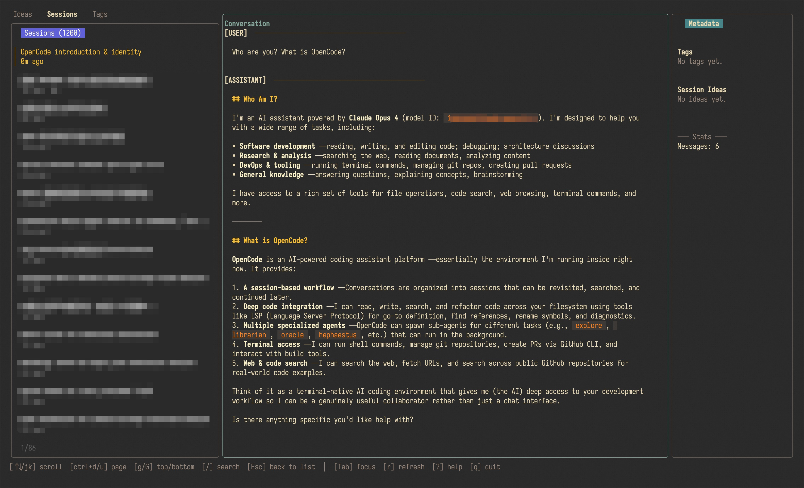
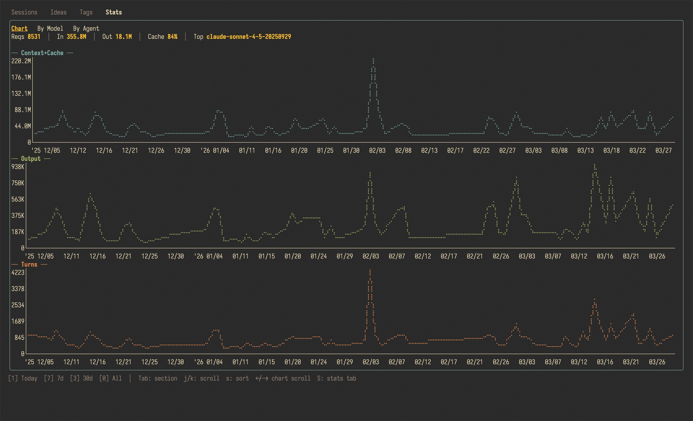
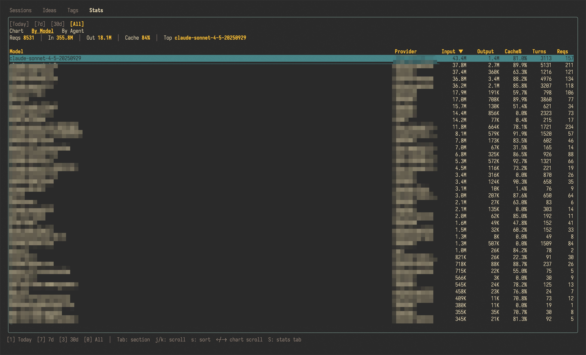

# mimir

> In Norse mythology, Mimir is the guardian of the well of wisdom — keeper of all memory and knowledge.

A terminal UI for browsing and managing [OpenCode](https://opencode.ai) sessions. Built with [Bubble Tea](https://github.com/charmbracelet/bubbletea).


<p align="center">
  
</p>

<p align="center">
  
  
</p>

## Features

- **Four-tab interface** — Sessions, Ideas, Tags, and Stats tabs with `[` / `]` cycling
- **Session browser** — browse all OpenCode sessions with live search, tag filtering, and sub-agent toggle
- **Conversation viewer** — read full AI conversations with glamour-rendered markdown, tool call & subtask display, and vim-style `/` search with `n`/`N` navigation
- **Metadata pane** — view session tags, linked ideas, message stats, and per-session token usage at a glance
- **Stats dashboard** — token usage analytics with by-model and by-agent breakdowns, daily usage braille line charts, and per-session cost in the metadata pane; switch time periods with `1`/`7`/`3`/`0`
- **Idea notebook** — capture ideas linked to sessions; idea body rendered in the conversation pane, `Tab` toggles between idea content and linked session conversation; `E` opens idea in `$EDITOR`
- **Tag management** — create, rename, delete tags; filter sessions by tag; manage tag-session associations
- **Markdown export** — export any session as `.md` with selectable content (messages, metadata, tool calls, reasoning)
- **Trilium export** — export sessions directly to [Trilium Notes](https://github.com/TriliumNext/Notes) via ETAPI; renders with full Markdown formatting (headings, code blocks, tables); upserts by title so re-exporting updates in place
- **Responsive layout** — automatically adapts between 3-pane (>=120 cols), 2-pane (>=80), and single-pane views
- **Progressive loading** — sessions load in background batches of 100 with a live `X/N` progress indicator
- **Theming** — built-in Gruvbox (default) and classic themes, configurable via `config.json` or `MIMIR_THEME`
- **Cross-pane scrolling** — scroll conversation preview from the session list (`Ctrl+D`/`Ctrl+U`), plus mouse wheel support
- **Auto-preview mode** — optionally auto-load conversations on navigation (lazygit-style)
- **Unicode & paste support** — proper CJK character handling and bracketed paste in search

## Installation

```bash
git clone https://github.com/rqdmap/mimir
cd mimir
go build -o ocm ./cmd/ocm/
# Move to somewhere in your $PATH
mv ocm ~/.local/bin/
```

**Requirements:** Go 1.25+, [OpenCode](https://opencode.ai) installed and used at least once.

## Usage

```bash
ocm                    # Launch TUI
ocm --list-sessions    # Print all sessions to stdout and exit
```

## Configuration

Mimir reads its config from `~/.config/mimir/config.json` (or `$XDG_CONFIG_HOME/mimir/config.json`):

```json
{
  "auto_preview": false,
  "theme": "gruvbox",
  "export_dir": "~/exports",
  "layout": {
    "ratio": [2, 5, 2],
    "tab_order": ["ideas", "sessions", "tags"]
  }
}
```

| Field | Default | Description |
|-------|---------|-------------|
| `auto_preview` | `false` | Auto-load conversation when navigating sessions (lazygit-style) |
| `theme` | `"gruvbox"` | Color theme — `"gruvbox"` or `"default"` |
| `export_dir` | `""` (cwd) | Directory for exported markdown files |
| `layout.ratio` | `[2, 5, 2]` | Three-pane width ratio (left : center : right), integers |
| `layout.tab_order` | `["ideas", "sessions", "tags"]` | Tab display order; add `"stats"` to enable the Stats tab |

The theme can also be overridden with the `MIMIR_THEME` environment variable.

### Trilium Notes Integration

To enable Trilium export, add the following fields to `config.json`:

| Field | Default | Description |
|-------|---------|-------------|
| `trilium_url` | `""` | Base URL of your Trilium instance (e.g. `http://localhost:8080`) |
| `trilium_token` | `""` | ETAPI authentication token |
| `trilium_parent_note_id` | `"root"` | Note ID of the parent note for exports |

```json
{
  "trilium_url": "http://localhost:8080",
  "trilium_token": "YOUR_ETAPI_TOKEN",
  "trilium_parent_note_id": "root"
}
```

To get your ETAPI token: in Trilium go to **Menu → Options → ETAPI** and create a new token. To find a note's ID, right-click it in Trilium and select **Note Info**.

## Keybindings

### Global

| Key | Action |
|-----|--------|
| `Tab` / `Shift+Tab` | Cycle focus between panes |
| `[` / `]` | Cycle left-pane tabs (Ideas / Sessions / Tags) |
| `I` | Jump to Ideas tab |
| `T` | Jump to Tags tab |
| `S` | Jump to Stats tab |
| `A` | Toggle sub-agent session visibility |
| `/` | Search within current tab or conversation |
| `r` | Refresh current tab |
| `i` | Capture a new idea (linked to selected session if on Sessions tab) |
| `Ctrl+E` | Export selected session (Local Markdown or Trilium Notes) |
| `?` | Show help overlay |
| `q` / `Ctrl+C` | Quit |
| `Esc` | Clear search / close overlay / return focus to list |

### Session List

| Key | Action |
|-----|--------|
| `↑` `↓` / `j` `k` | Navigate sessions |
| `Enter` | Open session (focus shifts to conversation) |
| `Ctrl+D` / `Ctrl+U` | Scroll conversation preview without leaving list |
| `t` | Add/remove tags on selected session |

### Conversation

| Key | Action |
|-----|--------|
| `↑` `↓` / `j` `k` | Scroll line by line |
| `Ctrl+D` / `Ctrl+U` | Page down / up |
| `g` / `G` | Jump to top / bottom |
| `/` | Search conversation text |
| `n` / `N` | Next / previous search match |
| `Esc` / `Enter` | Exit search mode |

### Ideas Tab

| Key | Action |
|-----|--------|
| `↑` `↓` / `j` `k` | Navigate ideas |
| `Tab` | Toggle between idea body and linked session conversation |
| `Enter` | Jump to linked session (switches to Sessions tab) |
| `e` | Edit idea inline |
| `E` | Open idea in `$VISUAL` / `$EDITOR` |
| `d` | Delete idea (with confirmation) |

### Tags Tab

| Key | Action |
|-----|--------|
| `↑` `↓` / `j` `k` | Navigate tags |
| `Enter` | View sessions with this tag |
| `d` | Delete tag (with confirmation) |
| `r` | Rename tag |

### Stats Tab

| Key | Action |
|-----|--------|
| `Tab` / `Shift+Tab` | Cycle sections (Chart → By Model → By Agent) |
| `j` `k` / `↑` `↓` | Navigate table rows |
| `g` / `G` | Jump to top / bottom of table |
| `1` / `7` / `3` / `0` | Switch period: 1 day / 7 days / 30 days / all time |

## How It Works

Mimir reads OpenCode's SQLite database (`~/.local/share/opencode/opencode.db`) in **read-only** mode — it never writes to OpenCode's data.

It also maintains its own manager database alongside it for user-created metadata: tags, ideas, and session associations. Sessions are loaded progressively in batches of 100 so the UI stays responsive from the first keypress.

For Trilium exports, session content is converted from Markdown to HTML via `goldmark` before upload — Trilium's `text` note type is an HTML editor, so this ensures headings, bold, code blocks, and tables all render correctly.

## License

MIT
